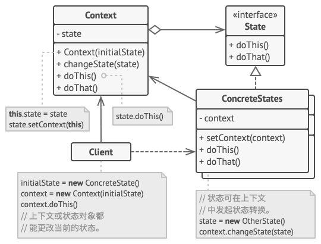

# 状态模式

:::tip

**状态模式**是一种行为设计模式， 让你能在一个对象的内部状态变化时改变其行为， 使其看上去就像改变了自身所属的类一样。
:::

## 结构



1. 上下文 （`Context`） 保存了对于一个具体状态对象的引用， 并会将所有与该状态相关的工作委派给它。 上下文通过状态接口与状态对象交互， 且会提供一个设置器用于传递新的状态对象。
2. 状态 （`State`） 接口会声明特定于状态的方法。 这些方法应能被其他所有具体状态所理解， 因为你不希望某些状态所拥有的方法永远不会被调用。
3. 具体状态 （`Concrete States`） 会自行实现特定于状态的方法。 为了避免多个状态中包含相似代码， 你可以提供一个封装有部分通用行为的中间抽象类。状态对象可存储对于上下文对象的反向引用。 状态可以通过该引用从上下文处获取所需信息， 并且能触发状态转移。
4. 上下文和具体状态都可以设置上下文的下个状态， 并可通过替换连接到上下文的状态对象来完成实际的状态转换。

## 适用场景

1. 如果对象需要根据自身当前状态进行不同行为， 同时状态的数量非常多且与状态相关的代码会频繁变更的话， 可使用状态模式。

    1. 模式建议你将所有特定于状态的代码抽取到一组独立的类中。 这样一来， 你可以在独立于其他状态的情况下添加新状态或修改已有状态， 从而减少维护成本。

2. 如果某个类需要根据成员变量的当前值改变自身行为， 从而需要使用大量的条件语句时， 可使用该模式。

    1. 状态模式会将这些条件语句的分支抽取到相应状态类的方法中。 同时， 你还可以清除主要类中与特定状态相关的临时成员变量和帮手方法代码。

3. 当相似状态和基于条件的状态机转换中存在许多重复代码时， 可使用状态模式。

    1. 状态模式让你能够生成状态类层次结构， 通过将公用代码抽取到抽象基类中来减少重复。

## 优缺点

### 优点

1. 单一职责原则。 将与特定状态相关的代码放在单独的类中。
2. 开闭原则。 无需修改已有状态类和上下文就能引入新状态。
3. 通过消除臃肿的状态机条件语句简化上下文代码。

### 缺点

1. 如果状态机只有很少的几个状态， 或者很少发生改变， 那么应用该模式可能会显得小题大作。

## 与其他模式的关系

1. 桥接模式、 状态模式和策略模式 （在某种程度上包括适配器模式） 模式的接口非常相似。 实际上， 它们都基于组合模式——即将工作委派给其他对象， 不过也各自解决了不同的问题。 模式并不只是以特定方式组织代码的配方， 你还可以使用它们来和其他开发者讨论模式所解决的问题。
2. 状态可被视为策略的扩展。 两者都基于组合机制： 它们都通过将部分工作委派给 “帮手” 对象来改变其在不同情景下的行为。 策略使得这些对象相互之间完全独立， 它们不知道其他对象的存在。 但状态模式没有限制具体状态之间的依赖， 且允许它们自行改变在不同情景下的状态。

## 代码实现

```typescript
class Context {
	private state: State;

	constructor(state: State) {
		this.transitionTo(state);
	}

	public transitionTo(state: State): void {
		this.state = state;
		this.state.setContext(this);
	}

	public request1(): void {
		this.state.handle1();
	}

	public request2(): string {
		return this.state.handle2();
	}
}

abstract class State {
	protected context: Context;

	public setContext(context: Context) {
		this.context = context;
	}

	public abstract handle1(): void;

	public abstract handle2(): string;
}

class ConcreteStateA extends State {
	public handle1(): void {
		this.context.transitionTo(new ConcreteStateB());
	}

	public handle2(): string {
		return 'ConcreteStateA handles request2.';
	}
}

class ConcreteStateB extends State {
	public handle1(): void {
		console.log('ConcreteStateB handles request1.');
	}

	public handle2(): string {
		this.context.transitionTo(new ConcreteStateA());
		return 'ConcreteStateB handles request2.';
	}
}
export { Context, State, ConcreteStateA, ConcreteStateB };
```

## 测试用例

```typescript
import { Context, ConcreteStateA } from '../index';

describe('state pattern', () => {
	it('state concrete creator', () => {
		const context = new Context(new ConcreteStateA());
		context.request1();
		expect(context.request2()).toBe('ConcreteStateB handles request2.');
	});
});
```
