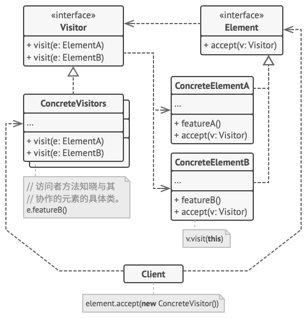

# 访问者模式

:::tip

**访问者模式**是一种行为设计模式， 它能将算法与其所作用的对象隔离开来。
:::

## 结构



1. 访问者 （`Visitor`） 接口声明了一系列以对象结构的具体元素为参数的访问者方法。 如果编程语言支持重载， 这些方法的名称可以是相同的， 但是其参数一定是不同的。
2. 具体访问者 （`Concrete Visitor`） 会为不同的具体元素类实现相同行为的几个不同版本。
3. 元素 （`Element`） 接口声明了一个方法来 “接收” 访问者。 该方法必须有一个参数被声明为访问者接口类型。
4. 具体元素 （`Concrete Element`） 必须实现接收方法。 该方法的目的是根据当前元素类将其调用重定向到相应访问者的方法。 请注意， 即使元素基类实现了该方法， 所有子类都必须对其进行重写并调用访问者对象中的合适方法。

## 适用场景

1. 如果你需要对一个复杂对象结构 （例如对象树） 中的所有元素执行某些操作， 可使用访问者模式。

    1. 访问者模式通过在访问者对象中为多个目标类提供相同操作的变体， 让你能在属于不同类的一组对象上执行同一操作。

2. 可使用访问者模式来清理辅助行为的业务逻辑。

    1. 该模式会将所有非主要的行为抽取到一组访问者类中， 使得程序的主要类能更专注于主要的工作。

3. 当某个行为仅在类层次结构中的一些类中有意义， 而在其他类中没有意义时， 可使用该模式。

    1. 你可将该行为抽取到单独的访问者类中， 只需实现接收相关类的对象作为参数的访问者方法并将其他方法留空即可。

## 优缺点

### 优点

1. 开闭原则。 你可以引入在不同类对象上执行的新行为， 且无需对这些类做出修改。
2. 单一职责原则。 可将同一行为的不同版本移到同一个类中。
3. 访问者对象可以在与各种对象交互时收集一些有用的信息。 当你想要遍历一些复杂的对象结构 （例如对象树）， 并在结构中的每个对象上应用访问者时， 这些信息可能会有所帮助。

### 缺点

1. 每次在元素层次结构中添加或移除一个类时， 你都要更新所有的访问者。
2. 在访问者同某个元素进行交互时， 它们可能没有访问元素私有成员变量和方法的必要权限。

## 与其他模式的关系

1. 你可以将访问者模式视为命令模式的加强版本， 其对象可对不同类的多种对象执行操作。
2. 你可以使用访问者对整个组合模式树执行操作。
3. 可以同时使用访问者和迭代器模式来遍历复杂数据结构， 并对其中的元素执行所需操作， 即使这些元素所属的类完全不同。

## 代码实现

```typescript
interface VisitorComponent {
	accept(visitor: Visitor): void;
}

class ConcreteComponentA implements VisitorComponent {
	public accept(visitor: Visitor): string {
		return visitor.visitConcreteComponentA(this);
	}

	public exclusiveMethodOfConcreteComponentA(): string {
		return 'A';
	}
}

class ConcreteComponentB implements VisitorComponent {
	public accept(visitor: Visitor): string {
		return visitor.visitConcreteComponentB(this);
	}

	public specialMethodOfConcreteComponentB(): string {
		return 'B';
	}
}

interface Visitor {
	visitConcreteComponentA(element: ConcreteComponentA): string;

	visitConcreteComponentB(element: ConcreteComponentB): string;
}

class ConcreteVisitor1 implements Visitor {
	public visitConcreteComponentA(element: ConcreteComponentA): string {
		return `${element.exclusiveMethodOfConcreteComponentA()} + ConcreteVisitor1`;
	}

	public visitConcreteComponentB(element: ConcreteComponentB): string {
		return `${element.specialMethodOfConcreteComponentB()} + ConcreteVisitor1`;
	}
}

class ConcreteVisitor2 implements Visitor {
	public visitConcreteComponentA(element: ConcreteComponentA): string {
		return `${element.exclusiveMethodOfConcreteComponentA()} + ConcreteVisitor2`;
	}

	public visitConcreteComponentB(element: ConcreteComponentB): string {
		return `${element.specialMethodOfConcreteComponentB()} + ConcreteVisitor2`;
	}
}

export {
	VisitorComponent,
	ConcreteComponentA,
	ConcreteComponentB,
	Visitor,
	ConcreteVisitor1,
	ConcreteVisitor2,
};
```

## 测试用例

```typescript
import {
	ConcreteVisitor1,
	ConcreteVisitor2,
	ConcreteComponentA,
	ConcreteComponentB,
} from '../index';

describe('template pattern', () => {
	it('template concrete creator', () => {
		const componentA = new ConcreteComponentA();
		const visitor1 = new ConcreteVisitor1();

		expect(componentA.accept(visitor1)).toBe('A + ConcreteVisitor1');

		const componentB = new ConcreteComponentB();
		const visitor2 = new ConcreteVisitor2();

		expect(componentB.accept(visitor2)).toBe('B + ConcreteVisitor2');
	});
});
```
