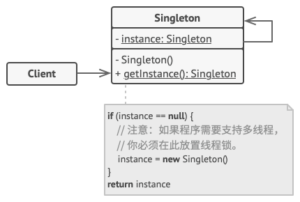

# 单例模式

:::tip

**单例模式**是一种创建型设计模式，能够保证一个类只有一个实例， 并提供一个访问该实例的全局节点。
:::

## 结构



1. 单例 （`Singleton`） 类声明了一个名为 get­Instance 获取实例的静态方法来返回其所属类的一个相同实例。

单例的构造函数必须对客户端 （`Client`） 代码隐藏。 调用 获取实例方法必须是获取单例对象的唯一方式。

## 适用场景

1. 如果程序中的某个类对于所有客户端只有一个可用的实例， 可以使用单例模式。

    1. 单例模式禁止通过除特殊构建方法以外的任何方式来创建自身类的对象。 该方法可以创建一个新对象， 但如果该对象已经被创建， 则返回已有的对象。

2. 如果你需要更加严格地控制全局变量， 可以使用单例模式。

    1. 单例模式与全局变量不同， 它保证类只存在一个实例。 除了单例类自己以外， 无法通过任何方式替换缓存的实例。

    请注意， 你可以随时调整限制并设定生成单例实例的数量， 只需修改 获取实例方法， 即 getInstance 中的代码即可实现。

## 优缺点

### 优点

1. 你可以保证一个类只有一个实例。
2. 你获得了一个指向该实例的全局访问节点。
3. 仅在首次请求单例对象时对其进行初始化。

### 缺点

1. 违反了单一职责原则。 该模式同时解决了两个问题。
2. 单例模式可能掩盖不良设计， 比如程序各组件之间相互了解过多等。
3. 该模式在多线程环境下需要进行特殊处理， 避免多个线程多次创建单例对象。
4. 单例的客户端代码单元测试可能会比较困难， 因为许多测试框架以基于继承的方式创建模拟对象。 由于单例类的构造函数是私有的， 而且绝大部分语言无法重写静态方法， 所以你需要
5. 出仔细考虑模拟单例的方法。 要么干脆不编写测试代码， 或者不使用单例模式。

## 与其他模式的关系

1. 如果你能将对象的所有共享状态简化为一个享元对象， 那么享元模式就和单例类似了。 但这两个模式有两个根本性的不同。

    1. 只会有一个单例实体， 但是享元类可以有多个实体， 各实体的内在状态也可以不同。
    2. 单例对象可以是可变的。 享元对象是不可变的。

2. 抽象工厂模式、 生成器模式和原型模式都可以用单例来实现。

## 代码实现

```typescript
class Singleton {
	private static instance: Singleton;

	private constructor() {}

	public static getInstance(): Singleton {
		if (!Singleton.instance) {
			Singleton.instance = new Singleton();
		}

		return Singleton.instance;
	}

	public someBusinessLogic() {}
}

export { Singleton };
```

## 测试用例

```typescript
import { Singleton } from '../index';

describe('singleton pattern', () => {
	it('singleton instance', () => {
		const s1 = Singleton.getInstance();
		const s2 = Singleton.getInstance();

		expect(s1 === s2).toBe(true);
	});
});
```
