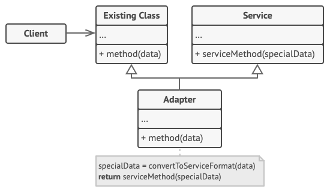

# 适配器模式

:::tip

**适配器模式**是一种结构型设计模式， 它能使接口不兼容的对象能够相互合作。
:::

## 结构

### 对象适配器


1. 客户端 （`Client`） 是包含当前程序业务逻辑的类。
2. 客户端接口 （`Client Interface`） 描述了其他类与客户端代码合作时必须遵循的协议。
3. 服务 （`Service`） 中有一些功能类 （通常来自第三方或遗留系统）。 客户端与其接口不兼容， 因此无法直接调用其功能。
4. 适配器 （`Adapter`） 是一个可以同时与客户端和服务交互的类： 它在实现客户端接口的同时封装了服务对象。 适配器接受客户端通过适配器接口发起的调用， 并将其转换为适用于被封装服务对象的调用。
5. 客户端代码只需通过接口与适配器交互即可， 无需与具体的适配器类耦合。 因此， 你可以向程序中添加新类型的适配器而无需修改已有代码。 这在服务类的接口被更改或替换时很有用： 你无需修改客户端代码就可以创建新的适配器类。

### 类适配器



1. 类适配器不需要封装任何对象， 因为它同时继承了客户端和服务的行为。 适配功能在重写的方法中完成。 最后生成的适配器可替代已有的客户端类进行使用。

## 适用场景

1. 当你希望使用某个类， 但是其接口与其他代码不兼容时， 可以使用适配器类。

    1. 适配器模式允许你创建一个中间层类， 其可作为代码与遗留类、 第三方类或提供怪异接口的类之间的转换器。

2. 如果您需要复用这样一些类， 他们处于同一个继承体系， 并且他们又有了额外的一些共同的方法， 但是这些共同的方法不是所有在这一继承体系中的子类所具有的共性。

    1. 你可以扩展每个子类， 将缺少的功能添加到新的子类中。 但是， 你必须在所有新子类中重复添加这些代码， 这样会使得代码有坏味道。
    2. 将缺失功能添加到一个适配器类中是一种优雅得多的解决方案。 然后你可以将缺少功能的对象封装在适配器中， 从而动态地获取所需功能。 如要这一点正常运作， 目标类必须要有通用接口， 适配器的成员变量应当遵循该通用接口。 这种方式同装饰模式非常相似。

## 优缺点

### 优点

1. 单一职责原则你可以将接口或数据转换代码从程序主要业务逻辑中分离。
2. 开闭原则。 只要客户端代码通过客户端接口与适配器进行交互， 你就能在不修改现有客户端代码的情况下在程序中添加新类型的适配器。

### 缺点

1. 代码整体复杂度增加， 因为你需要新增一系列接口和类。 有时直接更改服务类使其与其他代码兼容会更简单。

## 与其他模式的关系

1. 桥接模式通常会于开发前期进行设计， 使你能够将程序的各个部分独立开来以便开发。 另一方面， 适配器模式通常在已有程序中使用， 让相互不兼容的类能很好地合作。
2. 适配器可以对已有对象的接口进行修改， 装饰模式则能在不改变对象接口的前提下强化对象功能。 此外， 装饰还支持递归组合， 适配器则无法实现。
3. 适配器能为被封装对象提供不同的接口， 代理模式能为对象提供相同的接口， 装饰则能为对象提供加强的接口。
4. 外观模式为现有对象定义了一个新接口， 适配器则会试图运用已有的接口。 适配器通常只封装一个对象， 外观通常会作用于整个对象子系统上。
5. 桥接、 状态模式和策略模式 （在某种程度上包括适配器） 模式的接口非常相似。 实际上， 它们都基于组合模式——即将工作委派给其他对象， 不过也各自解决了不同的问题。 模式并不只是以特定方式组织代码的配方， 你还可以使用它们来和其他开发者讨论模式所解决的问题。

## 代码实现

```typescript
class Target {
	public request(): string {
		return 'request';
	}
}

class Adaptee {
	public specificRequest(): string {
		return 'specify request';
	}
}

class Adapter extends Target {
	private adaptee: Adaptee;

	constructor(adaptee: Adaptee) {
		super();
		this.adaptee = adaptee;
	}

	public request(): string {
		const result = this.adaptee.specificRequest().split(' ').reverse().join(' ');
		return `Adapter: (TRANSLATED) ${result}`;
	}
}

export { Target, Adaptee, Adapter };
```

## 测试用例

```typescript
import { Adaptee, Adapter, Target } from '../index';

describe('adapter pattern', () => {
	it('adapter concrete', () => {
		const target = new Target();
		const adaptee = new Adaptee();
		const adapter = new Adapter(adaptee);

		expect(adaptee.specificRequest()).toBe('specify request');
		expect(adapter.request()).toBe('Adapter: (TRANSLATED) request specify');
	});
});
```
