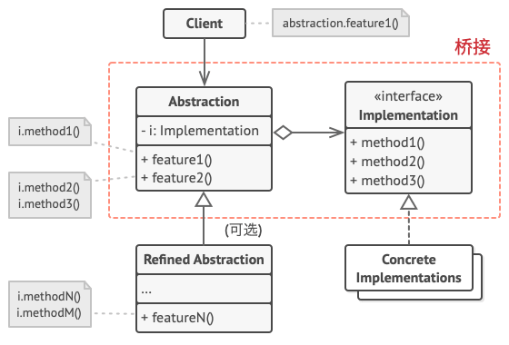

# 桥接模式

:::tip

**桥接模式**是一种结构型设计模式， 可将一个大类或一系列紧密相关的类拆分为抽象和实现两个独立的层次结构， 从而能在开发时分别使用。
:::

## 结构



1. 抽象部分 （`Abstraction`） 提供高层控制逻辑， 依赖于完成底层实际工作的实现对象。
2. 实现部分 （`Implementation`） 为所有具体实现声明通用接口。 抽象部分仅能通过在这里声明的方法与实现对象交互。抽象部分可以列出和实现部分一样的方法， 但是抽象部分通常声明一些复杂行为， 这些行为依赖于多种由实现部分声明的原语操作。
3. 具体实现 （`Concrete Implementations`） 中包括特定于平台的代码。
4. 精确抽象 （`Refined Abstraction`） 提供控制逻辑的变体。 与其父类一样， 它们通过通用实现接口与不同的实现进行交互。
5. 通常情况下， 客户端 （`Client`） 仅关心如何与抽象部分合作。 但是， 客户端需要将抽象对象与一个实现对象连接起来。

## 适用场景

1. 如果你想要拆分或重组一个具有多重功能的庞杂类 （例如能与多个数据库服务器进行交互的类）， 可以使用桥接模式。

    1. 类的代码行数越多， 弄清其运作方式就越困难， 对其进行修改所花费的时间就越长。 一个功能上的变化可能需要在整个类范围内进行修改， 而且常常会产生错误， 甚至还会有一些严重的副作用。
    2. 桥接模式可以将庞杂类拆分为几个类层次结构。 此后， 你可以修改任意一个类层次结构而不会影响到其他类层次结构。 这种方法可以简化代码的维护工作， 并将修改已有代码的风险降到最低。

2. 如果你希望在几个独立维度上扩展一个类， 可使用该模式。

    1. 桥接建议将每个维度抽取为独立的类层次。 初始类将相关工作委派给属于对应类层次的对象， 无需自己完成所有工作。

3. 如果你需要在运行时切换不同实现方法， 可使用桥接模式。

    1. 当然并不是说一定要实现这一点， 桥接模式可替换抽象部分中的实现对象， 具体操作就和给成员变量赋新值一样简单。

## 优缺点

### 优点

1. 你可以创建与平台无关的类和程序。
2. 客户端代码仅与高层抽象部分进行互动， 不会接触到平台的详细信息。
3. 开闭原则。 你可以新增抽象部分和实现部分， 且它们之间不会相互影响。
4. 单一职责原则。 抽象部分专注于处理高层逻辑， 实现部分处理平台细节。

### 缺点

1. 对高内聚的类使用该模式可能会让代码更加复杂。

## 与其他模式的关系

1. 桥接模式通常会于开发前期进行设计， 使你能够将程序的各个部分独立开来以便开发。 另一方面， 适配器模式通常在已有程序中使用， 让相互不兼容的类能很好地合作。
2. 桥接、 状态模式和策略模式 （在某种程度上包括适配器） 模式的接口非常相似。 实际上， 它们都基于组合模式——即将工作委派给其他对象， 不过也各自解决了不同的问题。 模式并不只是以特定方式组织代码的配方， 你还可以使用它们来和其他开发者讨论模式所解决的问题。
3. 可以将抽象工厂模式和桥接搭配使用。 如果由桥接定义的抽象只能与特定实现合作， 这一模式搭配就非常有用。 在这种情况下， 抽象工厂可以对这些关系进行封装， 并且对客户端代码隐藏其复杂性。
4. 可以结合使用生成器模式和桥接模式： 主管类负责抽象工作， 各种不同的生成器负责实现工作。

## 代码实现

```typescript
class Abstraction {
	protected implementation: Implementation;

	constructor(implementation: Implementation) {
		this.implementation = implementation;
	}

	public operation(): string {
		const result = this.implementation.operationImplementation();
		return result;
	}
}

class ExtendedAbstraction extends Abstraction {
	public operation(): string {
		const result = this.implementation.operationImplementation();
		return result;
	}
}

interface Implementation {
	operationImplementation(): string;
}

class ConcreteImplementationA implements Implementation {
	public operationImplementation(): string {
		return 'ConcreteImplementationA';
	}
}

class ConcreteImplementationB implements Implementation {
	public operationImplementation(): string {
		return 'ConcreteImplementationB';
	}
}

export {
	Abstraction,
	ExtendedAbstraction,
	Implementation,
	ConcreteImplementationA,
	ConcreteImplementationB,
};
```

## 测试用例

```typescript
import { ConcreteImplementationA, ConcreteImplementationB, Abstraction } from '../index';

describe('bridge pattern', () => {
	it('bridge concrete A', () => {
		const implementationA = new ConcreteImplementationA();
		const abstractionA = new Abstraction(implementationA);

		expect(abstractionA.operation()).toBe('ConcreteImplementationA');
	});

	it('bridge concrete B', () => {
		const implementationB = new ConcreteImplementationB();
		const abstractionB = new Abstraction(implementationB);

		expect(abstractionB.operation()).toBe('ConcreteImplementationB');
	});
});
```
